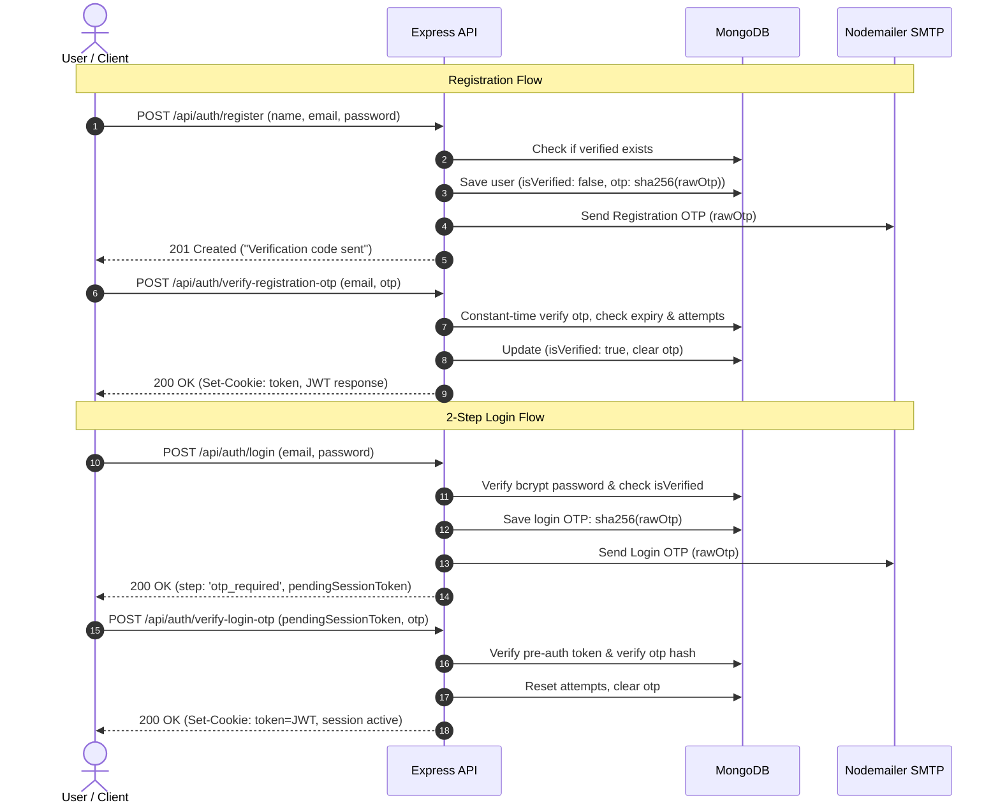

# 🔒 Security Review & Hardening

This document summarizes the security analysis of the **AI eBook Generator** and the mitigations applied across the full stack.

---

## Vulnerabilities & Applied Mitigations

### 1. Critical: Two-Step Verification (2FA Email OTP) & Credential Protection
- **Vulnerability**: Traditional single-step email + password authentication exposed user accounts to credential stuffing, password spray, and dictionary attacks.
- **Mitigation**:
  - **Registration Verification**: Accounts are created with `isVerified: false`. Users must submit a 6-digit numeric OTP sent via Nodemailer SMTP to activate their account. Unverified accounts cannot authenticate.
  - **Two-Step Login**: Password authentication serves as Step 1 only. Upon password match, a short-lived `pendingSessionToken` (10m) is returned, and a fresh 6-digit OTP is dispatched. The final JWT session cookie is issued only upon successful OTP verification.
  - **Cryptographic OTP Security**: Generated via `crypto.randomInt(100000, 1000000)`. Stored in MongoDB solely as SHA-256 hashes with an environment pepper secret (`OTP_SECRET`). Plaintext OTPs are never stored in the database or written to server logs.
  - **Constant-Time Verification**: Verification utilizes `crypto.timingSafeEqual` with dummy comparison fallbacks for non-existent users or expired records to eliminate timing side-channel attacks.

### 2. High: Account Lockout & Brute-Force Rate Limiting
- **Vulnerability**: Attackers could automate high-velocity OTP guessing (SMS/email bombing) or password brute-forcing.
- **Mitigation**:
  - **Account Lockout Policy**: After 5 consecutive failed verification or password attempts (`OTP_MAX_ATTEMPTS`), the account is locked for 15 minutes (`lockUntil = Date.now() + 15m`). Subsequent attempts return HTTP `423 Locked`.
  - **Scoped Rate Limiting**: Deployed endpoint-specific `express-rate-limit` middlewares keyed on both IP and normalized email (`${req.ip}_${email}`):
    - `POST /api/auth/resend-otp`: Max 3 requests per 15 minutes + 60s cooldown timer.
    - `POST /api/auth/verify-*-otp`: Max 10 attempts per 15 minutes.
    - `POST /api/auth/login`: Max 10 attempts per 15 minutes.
    - `POST /api/auth/forgot-password`: Max 5 requests per 15 minutes.

### 3. High: User Enumeration Defense
- **Vulnerability**: Differences in error messages ("Email not found" vs "Wrong password") allow attackers to enumerate valid email addresses.
- **Mitigation**:
  - `POST /api/auth/register`: Generic response ("If this email is valid, a verification code has been sent") for new and unverified accounts.
  - `POST /api/auth/login`: Returns uniform `401 Invalid email or password` with synthetic bcrypt delay when email does not exist.
  - `POST /api/auth/forgot-password`: Returns identical confirmation ("If this email is valid, a password reset code has been sent") regardless of account existence.

### 4. High: Global Session Invalidation on Password Reset
- **Vulnerability**: Changing or resetting a password failed to invalidate existing active JWT tokens on compromised devices.
- **Mitigation**: Added `tokenVersion` counter to the `User` schema. Every password reset increments `tokenVersion`, instantly invalidating all previously issued JWT tokens across all devices. The `protect` middleware strictly checks `decoded.tokenVersion === user.tokenVersion`.

### 5. High: Critical Authorization (IDOR) on eBook Routes
- **Vulnerability**: `getEbookById`, `updateEbook`, and `deleteEbook` originally fetched ebooks by `_id` without verifying the authenticated user.
- **Mitigation**: All eBook queries are strictly scoped with `{ _id: req.params.id, user: req.user._id }`. Cross-user access attempts return `404 Not Found`. Automated integration tests in `backend/tests/ebook.test.js` continuously verify this behavior.

### 6. High: Prompt Injection & AI Abuse
- **Vulnerability**: User-submitted titles and descriptions were passed directly into generative AI prompt strings without delimiter boundaries.
- **Mitigation**: `backend/services/geminiService.js` applies `sanitizePromptInput` to strip escape characters and wraps inputs in clear delimiters. Gemini API calls are wrapped in an exponential retry backoff (3 attempts) with a 35s hard timeout.

### 7. High: Input Validation & Sanitization
- **Vulnerability**: Endpoints previously accepted arbitrary, oversized, or malformed JSON payloads.
- **Mitigation**: Standardized Joi schemas validate all request bodies for user registration, login, OTP verification, password resets, profile updates, eBook creation/editing, and testimonials before reaching controllers. All schemas enforce `.unknown(false)` to reject extraneous parameters.

### 8. Medium: HTTP-Only Cookie Session Security
- **Vulnerability**: Storing auth tokens exclusively in `localStorage` leaves sessions vulnerable to Cross-Site Scripting (XSS) token theft.
- **Mitigation**: JWT sessions are delivered via `Set-Cookie` with `httpOnly: true`, `secure: process.env.NODE_ENV === 'production'`, `sameSite: 'strict'` (or `'lax'`), preventing client-side script access.

### 9. Medium: Unrestricted CORS
- **Vulnerability**: `app.use(cors())` permitted cross-origin requests from any domain.
- **Mitigation**: Configured origin allowlisting via `CORS_ORIGIN` environment variable with credentials support.

### 10. Medium: Missing HTTP Security Headers
- **Vulnerability**: Missing security headers (MIME sniffing, clickjacking, XSS).
- **Mitigation**: Integrated `helmet` middleware.

### 11. Medium: Verbose Internal Error Leaks
- **Vulnerability**: Stack traces and database internals were sent directly to clients.
- **Mitigation**: Centralized `errorHandler.js` returns clean, user-friendly JSON error messages while logging diagnostics server-side.

### 12. GDPR Compliance: Right to Erasure
- **Vulnerability**: Users had no mechanism to delete their personal data or generated books.
- **Mitigation**: Added authenticated `DELETE /api/auth/account` endpoint that permanently purges user credentials and all associated eBook records from MongoDB.

---

## Security Controls Summary

| Control Area | Implementation |
|---|---|
| **Two-Step Verification (2FA)** | 6-digit cryptographically secure OTP via Nodemailer; SHA-256 hashed storage |
| **Account Lockout** | 5 failed attempts -> 15-minute lockout (HTTP 423) |
| **Rate Limiting** | Endpoint & email-scoped `express-rate-limit` on all auth routes |
| **Timing Attack Defense** | `crypto.timingSafeEqual` + constant-time dummy comparisons |
| **Anti-Enumeration** | Identical generic response shapes for existing vs non-existing emails |
| **Global Session Revocation** | `tokenVersion` invalidation on password reset |
| **Session Delivery** | `httpOnly`, `secure`, `sameSite` JWT cookies |
| **Security Headers** | `helmet` HTTP headers |
| **CORS Policy** | Origin allowlist via `CORS_ORIGIN` env variable with credentials |
| **Input Validation** | Strict Joi schemas rejecting unknown fields (`.unknown(false)`) |
| **Password Policy** | Regex complexity requirement (min 8 chars, Aa1@) |
| **IDOR Prevention** | Scoped queries `{ _id, user: req.user._id }` |
| **Prompt Sanitization** | `geminiService.sanitizePromptInput` + delimiter isolation |
| **AI Reliability** | 3-attempt backoff + 35s hard timeout |
| **GDPR Erasure** | `DELETE /api/auth/account` permanently deletes user & books |
| **Automated Testing** | 38 automated Jest + Supertest integration tests in CI |

---

## Authentication & Session Flow

